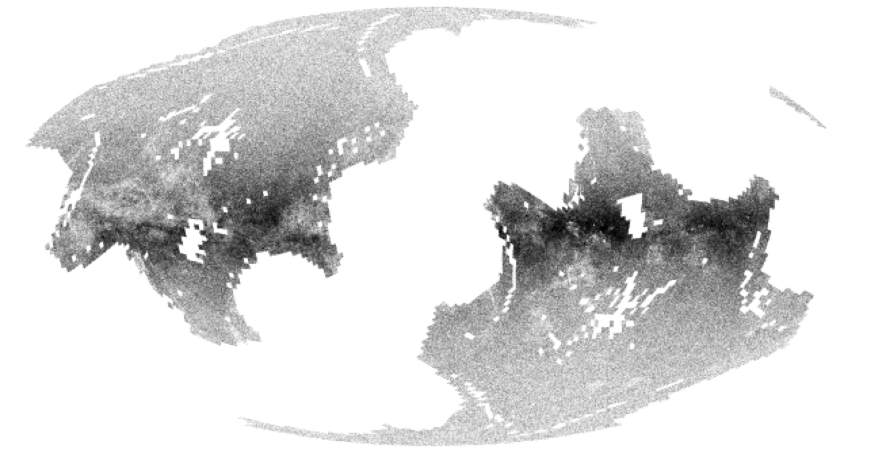

gaia_tools
-----------

Tools for working with the `ESA/Gaia <http://sci.esa.int/gaia/>`__
data and related data sets (`APOGEE
<http://www.sdss.org/surveys/apogee/>`__, `GALAH
<https://galah-survey.org/>`__, `LAMOST DR2
<http://dr2.lamost.org/>`__, and `RAVE
<https://www.rave-survey.org/project/>`__).

.. contents::

AUTHORS
========

 * Jo Bovy - bovy at astro dot utoronto dot ca

with contributions from

 * Miguel de Val-Borro
 * Simon Walker

ACKNOWLEDGING USE OF THIS CODE
==============================

Please refer back to this repository when using this code in your
work. If you use the TGAS selection-function code in
``gaia_tools.select.tgasSelect``, please cite `Bovy (2017)
<http://adsabs.harvard.edu/abs/2017MNRAS.470.1360B>`__.

INSTALLATION
============

Standard python setup.py build/install

Either

``sudo python setup.py install``

or install to a custom directory with

``python setup.py install --prefix=/some/directory/``

or in your home directory with

``python setup.py install --user``

DEPENDENCIES AND PYTHON VERSIONS
=================================

This package requires `NumPy <http://www.numpy.org/>`__, `astropy
<http://www.astropy.org/>`__, `astroquery
<https://astroquery.readthedocs.io/en/latest/>`__, `tqdm
<https://github.com/noamraph/tqdm>`__, and `dateutil
<https://dateutil.readthedocs.io>`__. Additionally, some functions
require `Scipy <http://www.scipy.org/>`__ and `galpy
<https://github.com/jobovy/galpy>`__. The selection-function code
requires `healpy <https://github.com/healpy/healpy>`__ (most
conveniently installed using ``conda``); the
effective-selection-function code requires `mwdust
<https://github.com/jobovy/mwdust>`__ for dealing with extinction. If
the `apogee <https://github.com/jobovy/apogee>`__ package is
installed, this package will use that to access the APOGEE data;
otherwise they are downloaded separately into the **GAIA_TOOLS_DATA**
directory (see below). With standard installation, astropy is used to
read FITS files. Installing `fitsio
<http://github.com/esheldon/fitsio>`__ will cause those routines to
take precedence over `astropy
<http://docs.astropy.org/en/stable/io/fits/index.html>`__.

This package should work in both python 2 and 3. Please open an `issue
<https://github.com/jobovy/gaia_tools/issues>`__ if you find a part of the
code that does not support python 3.

DATA FILES AND ENVIRONMENT VARIABLES
=====================================

This code will download and store various data files. The top-level
location of where these are stored is set by the **GAIA_TOOLS_DATA**
environment variable, which is the path of the top-level directory
under which the data will be stored. To use the `apogee
<https://github.com/jobovy/apogee>`__ functionality, you also need to
set the environment variables appropriate for that package.

BASIC USE
==========

Catalog reading
^^^^^^^^^^^^^^^

The basic use of the code is to read various data files and match them
to each other. For example, to load the `TGAS <http://www.cosmos.esa.int/web/gaia/iow_20150115>`__ data, do::

    import gaia_tools.load as gload
    tgas_cat= gload.tgas()

The first time you use this function, it will download the TGAS data
and return the catalog (the data is stored locally in a manner that
mirrors the Gaia Archive, so downloading only happens once).

Similarly, you can load the RV subsample of `Gaia DR2 <https://www.cosmos.esa.int/web/gaia/dr2>`__ using::

    gaiarv_cat= gload.gaiarv()

which again downloads the data upon the first invocation (and also converts it to fits format for faster access in the futures; not that the original CSV files are retained under ``$GAIA_TOOLS_DATA/Gaia/gdr2/gaia_source_with_rv/csv`` and you might want to delete these to save space).

``gaia_tools`` can also load data from various additional surveys, for example, for the `GALAH <https://galah-survey.org/>`__ survey's DR2 data, do::

    galah_cat= gload.galah()

Through an interface to the more detailed `apogee
<https://github.com/jobovy/apogee>`__ package, you can also load
various APOGEE data files, for example::

	apogee_cat= gload.apogee()
	rc_cat= gload.apogeerc()

If you don't have the `apogee <https://github.com/jobovy/apogee>`__
package installed, the code will still download the data, but less
options for slicing the catalog are available. The `GALAH`, `apogee`, and `apogeerc` catalog can also be cross-matched to Gaia DR2 upon loading, e.g., as::

  rc_cat, gaia2_matches= gload.apogeerc(xmatch='gaiadr2')

through an interface to the ``gaia_tools.xmatch.cds`` function
described below (keywords of that function can be specified here as
well). This will return only the stars in the overlap of the two
catalogs. The results from the cross-match are cached such that this
function will run much faster the second time if run with the same
parameters. Note that the caching ignores the option
``gaia_all_columns`` described below; if you first do the cross-match
with that option, that result will be saved, otherwise not; the cached
result will be returned regardless of the value of
``gaia_all_columns`` in the call (remove the cached file to re-do the
cross-match; the cached file is in the same directory as the data
file; see ``gaia_tools.load.path``).

Similarly, you can load the `RAVE
<https://www.rave-survey.org/project/>`__ and `RAVE-on
<https://zenodo.org/record/154381#.V-D27pN97ox>`__ data as::

	rave_cat= gload.rave()
	raveon_cat= gload.raveon()

Last but not least, you can also load the `LAMOST DR2
<http://dr2.lamost.org/>`__ data as::

	lamost_cat= gload.lamost()

or::

	lamost_star_cat= gload.lamost(cat='star')

for just the stars.

Cross-matching
^^^^^^^^^^^^^^

To match catalogs to each other, use the tools in
``gaia_tools.xmatch``. For example, to match the GALAH and APOGEE-RC
catalogs loaded above and compare the effective temperatures for the
stars in common, you can do::

	 from gaia_tools import xmatch
	 m1,m2,sep= xmatch.xmatch(rc_cat,galah_cat,colDec2='dec')
	 print(rc_cat[m1]['TEFF']-galah_cat[m2]['Teff'])
	      Teff     
	      K       
	 --------------
	 -12.3999023438
	  0.39990234375

which matches objects using their celestial coordinates using the
default maximum separation of 2 arcsec. To match catalogs with
coordinates at epoch 2000.0 to the TGAS data, which is at epoch 2015.,
give the ``epoch1`` and ``epoch2`` keyword. For example, to
cross-match the APOGEE-RC data and TGAS do::

	    tgas= gload.tgas()
	    aprc= gload.apogeerc()
	    m1,m2,sep= xmatch.xmatch(aprc,tgas,colRA2='ra',colDec2='dec',epoch2=2015.)
	    aprc= aprc[m1]
	    tgas= tgas[m2]

Further, it is possible to cross-match any catalog to the catalogs in
the CDS database using the `CDS cross-matching service
<http://cdsxmatch.u-strasbg.fr/xmatch>`__. For example, to match the
GALAH catalog to the Gaia DR2 catalog, do the following::

   gaia2_matches, matches_indx= xmatch.cds(galah_cat,colRA='raj2000',colDec='dej2000',xcat='vizier:I/345/gaia2')
   print(galah_cat['raj2000'][matches_indx[0]],gaia2_matches['ra_epoch2000'][0],gaia2_matches['pmra'][matches_indx[0]],gaia2_matches['pmdec'][matches_indx[0]])
   (0.00047,0.00049021022,22.319,-10.229)

If you want *all* columns in Gaia DR2, specify
``gaia_all_columns=True``. This will first run the CDS cross-match,
then upload the result to the Gaia Archive, and join to the
``gaia_source`` table to return all columns. If the Gaia Archive
cannot be reached for some reason, the limited subset of columns
returned by CDS is returned instead.

If you want to download a catalog from CDS, you can use
``gaia_tools.load.download.vizier``.

Tools for querying the Gaia Archive
^^^^^^^^^^^^^^^^^^^^^^^^^^^^^^^^^^^

The large amount of data in Gaia's DR2 means that to access the full
catalog, the easiest way is to perform ADQL or SQL queries against the
`Gaia Archive database <https://gea.esac.esa.int/archive/>`__. Some
tools to help with this are located in ``gaia_tools.query``.

The only function currently in this module is ``query.query``, which
can be used to send a query either to the central Gaia Archive or to a
local Postgres copy of the database. When using a local copy of the
database, the main Gaia table is best named ``gaiadr2_gaia_source``
(for ``gaiadr2.gaia_source`` on the Gaia Archive) and similarly
``gaiadr2_gaia_source_with_rv`` for the RV subset. In this case, the
*same* query can be run locally or remotely (``query.query`` will
automatically adjust the tablename), making it easy to mix use of the
local database and the Gaia Archive. The name and user of the local
database can be set using the ``dbname=`` and ``user=``
options. Queries can be timed using ``timeit=True``.

To setup your own local database with Gaia DR2, you can follow the
steps described about halfway down `this section
<http://astro.utoronto.ca/~bovy/group/data.html#2mass>`__. Note that
you will need >1TB of space and be familiar with Postgres database
management.

For example, to generate the average proper motion maps displayed
`here <https://twitter.com/jobovy/status/992455544291049472>`__, do::

      pm_query= """SELECT hpx5, AVG((c1*pmra+c2*pmdec)/cos(b_rad)) AS mpmll, 
      AVG((-c2*pmra+c1*pmdec)/cos(b_rad)) AS mpmbb
      FROM (SELECT source_id/562949953421312 as hpx5,pmra,pmdec,radians(b) as b_rad,parallax,
      0.4559838136873017*cos(radians(dec))-0.889988068265628*sin(radians(dec))*cos(radians(ra-192.85947789477598)) as c1,
      0.889988068265628*sin(radians(ra-192.85947789477598)) as c2 FROM gaiadr2.gaia_source
      WHERE phot_g_mean_mag < 17.) tab
      GROUP BY hpx5;"""
      # Add and random_index between 0 and 1000000 to the WHERE line for a quicker subset

and then run the query locally as::

    out= query.query(pm_query,local=True)

Setting ``local=False`` will run the query on the Gaia Archive (but
note that without the additional ``and random_index between 0 and
1000000`` the query will likely time out on the Gaia Archive; this is
one reason to have a local copy!)

``query.query`` by default also maintains a cache of queries run
previously. That is, if you run the exact same query a second time,
the cached result is returned rather than re-running the query (which
might take a while); this is useful, for example, when re-running a
piece of code for which running the query is only a single part. The
location of the cache directory is ``$HOME/.gaia_tools/query_cache``
where ``$HOME`` is your home directory. The results from queries are
cached as pickles, with filenames consisting of the date/time of when
the query was run and a hash of the query. You may rename cached
queries, as long as you retain the hash in the filename; this is
useful to keep track of queries that you do not want to lose and
knowing what queries they represent. To clean the cache, do::

	from gaia_tools.query import cache
	cache.clean()

which removes all cached files with the default ``date/time_hash.pkl``
filename format (that is, if you have renamed a cached file, it is not
removed by ``cache.clean()``). To remove absolutely all files
(including renamed ones), use ``cache.cleanall()``. Upon loading the
``gaia_tools.query`` module, cached files with the default
``date/time_hash.pkl`` filename format *older than one week* are
removed.

To turn off caching, run queries using ``use_cache=False``.

The TGAS selection function
^^^^^^^^^^^^^^^^^^^^^^^^^^^^

`Bovy (2017) <http://adsabs.harvard.edu/abs/2017MNRAS.470.1360B>`__
determines the raw TGAS selection function over the 48% of the sky
where the TGAS selection is well behaved. This selection function
gives the fraction of true point-like objects observed as a function
of *(J,J-Ks)* 2MASS photometry and as a function of position on the
sky. Bovy (2017) also discusses how to turn this raw selection
function into an effective selection function that returns the
fraction of true stars contained in the TGAS catalog as a function of
distance and position on the sky, for a given stellar population and
how to compute the fractional volume of a given spatial region that is
effectively contained in TGAS (this is the denominator in N/V when
computing bias-corrected densities based on TGAS star counts in a
certain spatial region). Tools to work with the raw and effective
selection functions are contained in the
``gaia_tools.select.tgasSelect`` sub-module.

The raw selection function is contained in an object and can be
instantiated as follows::

	     >>> import gaia_tools.select
	     >>> tsf= gaia_tools.select.tgasSelect()

When you run this code for the first time, a ~200 MB file that
contains 2MASS counts necessary for the selection function will be
downloaded. When instantiating the ``tgasSelect`` object, it is
possible to make different choices for some of the parameters
described by Bovy (2017), but it is best to leave all keywords at
their default values. To then evaluate the fraction observed at
*J=10*, *J-Ks* = 0.5, RA= 10 deg, Dec= 70.deg, do::

	 >>> tsf(10.,0.5,10.,70.)
	 array([ 0.7646336])

Another example::

	>>> tsf(10.,0.5,10.,20.)
	array([ 0.])

The latter is exactly zero because the (RA,Dec) combination falls
outside of the part of the sky over which the selection function is
well behaved. The method ``tsf.determine_statistical`` can return the
part of your TGAS sub-sample that is part of the sky over which the
selection function is well behaved. For example, to plot the data in
TGAS for which the selection function is determined, do::

     >>> import gaia_tools.load as gload
     >>> tgas_cat= gload.tgas()
     >>> twomass= gload.twomass()
     >>> indx= tsf.determine_statistical(tgas_cat,twomass['j_mag'],twomass['k_mag'])
     >>> import healpy
     >>> healpy.mollview(title="")
     >>> healpy.projplot(tgas_cat['l'][indx],tgas_cat['b'][indx],'k,',lonlat=True,alpha=0.03)
     
which gives

We can turn the raw TGAS selection function into an effective
selection function that is a function of distance rather than
magnitude for a given stellar population by specifying a sampling of
true intrinsic absolute *M_J* and true *J-Ks* for this stellar
population. We also require a three-dimensional extinction map,
although by default the extinction is set to zero (for this, you need
to install `mwdust <https://github.com/jobovy/mwdust>`__). A simple
example of this is the following instance::

	>>> import mwdust
	>>> tesf= gaia_tools.select.tgasEffectiveSelect(tsf,dmap3d=mwdust.Zero(),MJ=-1.,JK=0.65)

which is close to a red-clump effective selection function. We can
then evaluate ``tesf`` as a function of (distance,RA,Dec) to give the
fraction of stars with absolute *M_J = -1* and *J-Ks* = 0.65 contained
in TGAS, for example at 1 kpc distance and (RA,Dec) = (10,70)::

   >>> tesf(1.,10.,70.)
   array([ 0.89400531])

We could do the same taking extinction into account::

   >>> tesf_ext= gaia_tools.select.tgasEffectiveSelect(tsf,dmap3d=mwdust.Combined15(filter='2MASS J'),MJ=-1.,JK=0.65)
   >>> tesf_ext(1.,10.,70.)
   array([ 0.27263462])

This is much lower, because the extinction toward (RA,Dec) = (70,10)
=~ (l,b) = (122,7.1) is very high (A_J =~ 0.7). Note that the ``MJ``
and ``JK`` inputs can be arrays, in which case the result will be
averaged over these, and they can also be changed on-the-fly when
evaluating the effective selection function.

We can also compute the effective volume as defined by Bovy
(2017). For this, we need to define a function that defines the volume
over which we want to compute the effective volume. For example, a
cylindrical volume centered on the Sun is::

   def cyl_vol_func(X,Y,Z,xymin=0.,xymax=0.15,zmin=0.05,zmax=0.15):
       """A function that bins in cylindrical annuli around the Sun"""
       xy= numpy.sqrt(X**2.+Y**2.)
       out= numpy.zeros_like(X)
       out[(xy >= xymin)*(xy < xymax)*(Z >= zmin)*(Z < zmax)]= 1.
       return out

We can then compute the effective volume for a cylinder of radius 0.15
kpc from z=0.1 kpc to 0.2 kpc as::

    >>> dxy= 0.15
    >>> zmin= 0.1
    >>> zmax= 0.2
    >>> tesf.volume(lambda x,y,z: cyl_vol_func(x,y,z,xymax=dxy,zmin=zmin,zmax=zmax),ndists=101,xyz=True,relative=False)
    0.0023609512382473932

Setting ``relative=True`` would return the fractional effective
volume, that is, the effective volume divided by the true spatial
volume; computing the relative volume and multiplying it with the true
volume is a more robust method for computing the effective volume
(because pixelization effects in the computation of the effective
volume cancel out). Compare::

       >>> tesf.volume(lambda x,y,z: cyl_vol_func(x,y,z,xymax=dxy,zmin=zmin,zmax=zmax),ndists=101,xyz=True,relative=False)/(numpy.pi*dxy**2.*(zmax-zmin))
       0.33400627552533657

with::

	>>> tesf.volume(lambda x,y,z: cyl_vol_func(x,y,z,xymax=dxy,zmin=zmin,zmax=zmax),ndists=101,xyz=True,relative=True)
	0.3332136527277989

As you are running these examples, you will notice that evaluating the
effective volume is much faster the second time you do it (even for a
different volume). This is because the evaluation of the selection
function gets cached and re-used. Taking extinction into account (that
is, running these examples using ``tesf_ext`` rather than ``tesf``)
takes *much* longer. Tools to use multiprocessing are available in
this case.

For more examples of how to use this code, please see the
`tgas-completeness <https://github.com/jobovy/tgas-completeness>`__
repository, which contains all of the code to reproduce the results of
Bovy (2017).

RECIPES
========

Match APOGEE or APOGEE-RC to Gaia DR2
^^^^^^^^^^^^^^^^^^^^^^^^^^^^^^^^^^^^^

We can do this with the `CDS xMatch Service <http://cdsxmatch.u-strasbg.fr/>`__ using the ``gaia_tools.xmatch.cds`` routine:

    apogee_cat= gaia_tools.load.apogee()
    gaia2_matches, matches_indx= gaia_tools.xmatch.cds(apogee_cat,xcat='vizier:I/345/gaia2')
    apogee_cat= apogee_cat[matches_indx]
    print(len(apogee_cat))
    264423

(takes about fifteen minutes). Make the first line ``apogee_cat= gaia_tools.load.apogeerc()`` for the APOGEE-rc catalog.

Match RAVE to TGAS taking into account the epoch difference
^^^^^^^^^^^^^^^^^^^^^^^^^^^^^^^^^^^^^^^^^^^^^^^^^^^^^^^^^^^^

RAVE celestial positions (and more generally all of the positions in
the spectoscopic catalogs) are given at epoch J2000, while TGAS
reports positions at J2015. To match stars between RAVE and TGAS, we
therefore have to take into account the proper motion to account for
the 15 year difference. This can be done as follows::

    tgas= gaia_tools.load.tgas()
    rave_cat= gaia_tools.load.rave()
    m1,m2,sep= gaia_tools.xmatch.xmatch(rave_cat,tgas,
					colRA1='RAdeg',colDec1='DEdeg',
					colRA2='ra',colDec2='dec',
					epoch1=2000.,epoch2=2015.,swap=True)
    rave_cat= rave_cat[m1]
    tgas= tgas[m2]
    print(len(rave_cat))
    216201

The ``xmatch`` function is setup such that the second catalog is the
one that contains the proper motion if the epochs are different. This
is why TGAS is the second catalog. Normally, ``xmatch`` finds matches
for all entries in the first catalog. However, RAVE contains
duplicates, so this would return duplicate matches and the resulting
matched catalog would still contain duplicates. Because TGAS does not
contain duplicates, we can do the match the other way around using
``swap=True`` and get a catalog without duplicates. There is currently
no way to rank the duplicates by, e.g., their signal-to-noise ratio in
RAVE.

Match LAMOST to TGAS
^^^^^^^^^^^^^^^^^^^^^

Similar to RAVE above, we do::

    tgas= gaia_tools.load.tgas()
    lamost_cat= gaia_tools.load.lamost()
    m1,m2,sep= gaia_tools.xmatch.xmatch(lamost_cat,tgas,
					colRA1='ra',colDec1='dec',
					colRA2='ra',colDec2='dec',
					epoch1=2000.,epoch2=2015.,swap=True)
    lamost_cat= lamost_cat[m1]
    tgas= tgas[m2]
    print(len(lamost_cat))
    108910

Match APOGEE or APOGEE-RC to TGAS
^^^^^^^^^^^^^^^^^^^^^^^^^^^^^^^^^^

Similar to RAVE above, we do::

    tgas= gaia_tools.load.tgas()
    apogee_cat= gaia_tools.load.apogee()
    m1,m2,sep= gaia_tools.xmatch.xmatch(apogee_cat,tgas,
					colRA2='ra',colDec2='dec',
					epoch1=2000.,epoch2=2015.,swap=True)
    apogee_cat= apogee_cat[m1]
    tgas= tgas[m2]
    print(len(apogee_cat))
    20113

Make that second line ``apogee_cat= gaia_tools.load.apogeerc()`` for
the APOGEE-RC catalog.

Match GALAH DR1 to TGAS
^^^^^^^^^^^^^^^^^^^^^^^^

Similar to RAVE above, we do::

    tgas= gaia_tools.load.tgas()
    galah_cat= gaia_tools.load.galah(dr=1)
    m1,m2,sep= gaia_tools.xmatch.xmatch(galah_cat,tgas,
					colRA1='RA',colDec1='dec',
					colRA2='ra',colDec2='dec',
					epoch1=2000.,epoch2=2015.,swap=True)
    galah_cat= galah_cat[m1]
    tgas= tgas[m2]
    print(len(galah_cat))
    7919
    
API
====

(May or may not be fully up-to-date)

 * ``gaia_tools.load``
     * ``gaia_tools.load.apogee``
     * ``gaia_tools.load.apogeerc``
     * ``gaia_tools.load.gaiarv``
     * ``gaia_tools.load.galah``
     * ``gaia_tools.load.lamost``
     * ``gaia_tools.load.rave``
     * ``gaia_tools.load.raveon``
     * ``gaia_tools.load.tgas``
         * ``gaia_tools.load.download.vizier``
 * ``gaia_tools.query``
     * ``gaia_tools.query.query``
     * ``gaia_tools.query.cache``
        * ``gaia_tools.query.cache.autoclean``
        * ``gaia_tools.query.cache.clean``
        * ``gaia_tools.query.cache.cleanall``
        * ``gaia_tools.query.cache.current_files``
        * ``gaia_tools.query.cache.file_path``
        * ``gaia_tools.query.cache.load``
        * ``gaia_tools.query.cache.save``
 * ``gaia_tools.select``
     * ``gaia_tools.select.tgasSelect``
         * ``__call__``
	 * ``determine_statistical``
	 * ``plot_mean_quantity_tgas``
	 * ``plot_2mass``
	 * ``plot_tgas``
	 * ``plot_cmd``
	 * ``plot_magdist``
     * ``gaia_tools.select.tgasEffectiveSelect``
         * ``__call__``
	 * ``volume``
 * ``gaia_tools.xmatch``
     * ``gaia_tools.xmatch.xmatch``
     * ``gaia_tools.xmatch.cds``
     * ``gaia_tools.xmatch.cds_matchback``
